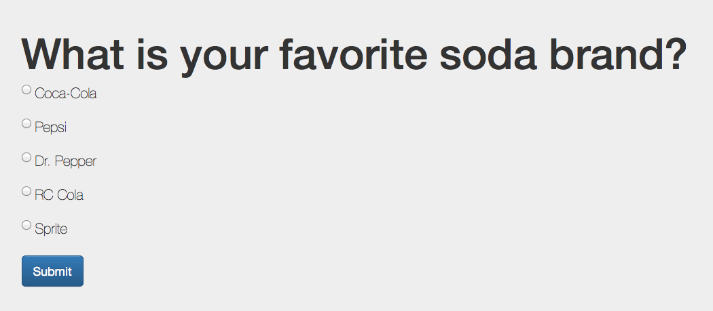
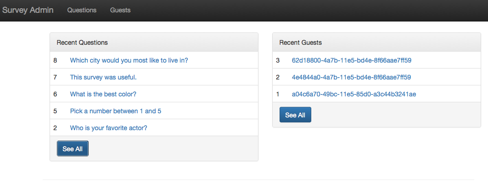
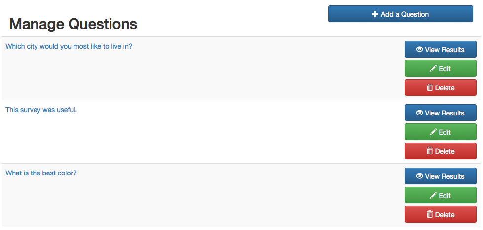
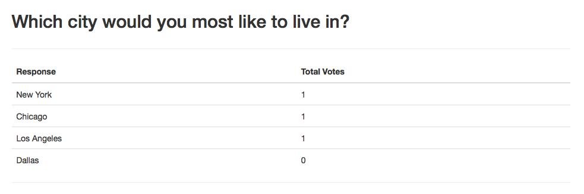
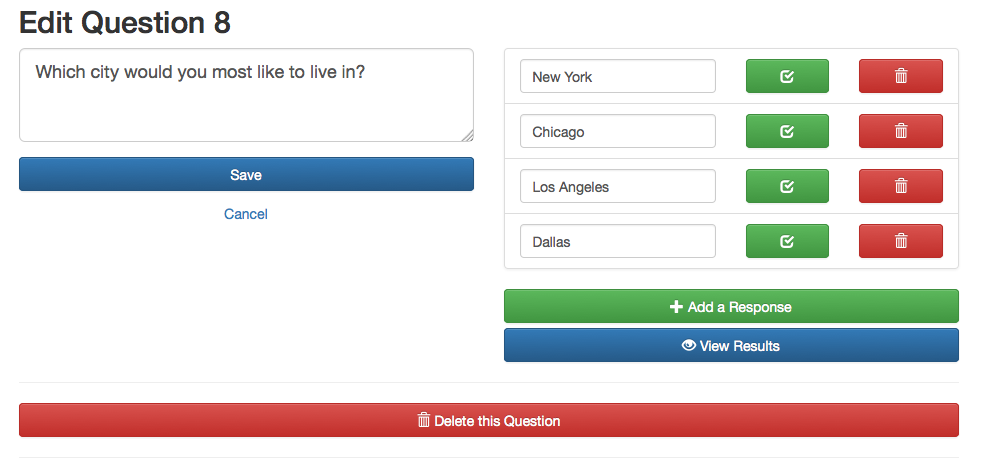
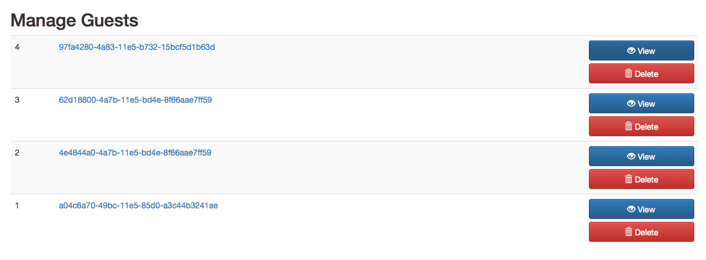
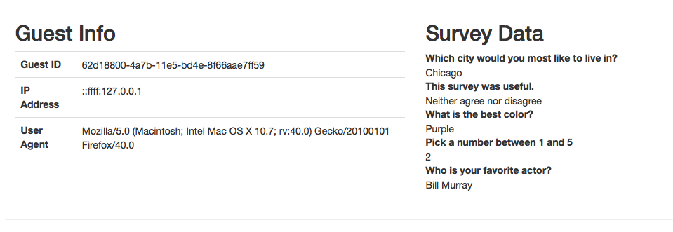
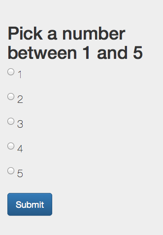
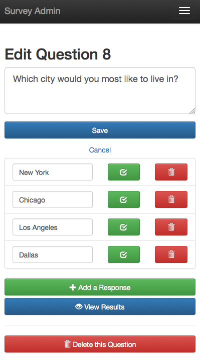

# Survey App

This application is a simple survey build in NodeJS with Express and Sequelize

## Setup & Installation

The first step is to check out the code from Github.

	# ssh
	git clone git@github.com:bubbafoley/survey.git

	# https
	git clone https://github.com/bubbafoley/survey.git

Now it's time to set up the database. Create a new MySQL database called `survey` and import the [db.sql]() file from the repository. This creates the database schema and also adds some sample data that can be viewed from the admin section.

Next install all of Node dependencies with npm and start the web server.

	npm install
	npm start

Now the app will be accessible from a web browser at [http://localhost:3000/]()

## Survey Questions

The app presents a user with a random survey question. Each time the page is reloaded a different question is shown. If a user has answered a question it is not shown again. When the questions are exhausted a message is displayed explaining that there are no more questions. 

When a new user visits the app they are given a unique identifier that is stored in the database and tracked in the browser with a cookie.

## Admin Section

The admin section is available at [http://localhost:3000/admin](). For the purpose of this demo it has not been password protected. The dashboard shows the 5 most recent questions and guests. Using the top navigation you can access both the question list and the guest list.

The questions page shows a list of all questions with options to add new questions, edit existing questions and view the survey results of a question.

The survey results page shows all of the response options and the number of times they were selected by a guest.

The edit question screen allows you to edit the question and edit the responses. You can alter the text of the questions, add/remove response options and delete the question.

The guests screen shows a list of unique ids of all the guests that have visited the app. 

When viewing guest information you can see their survey responses in addition to their IP address and browser user agent data.

## Mobile Responsive

The app uses Bootstrap's responsive utilities so there is a seamless experience between desktop and mobile.

 